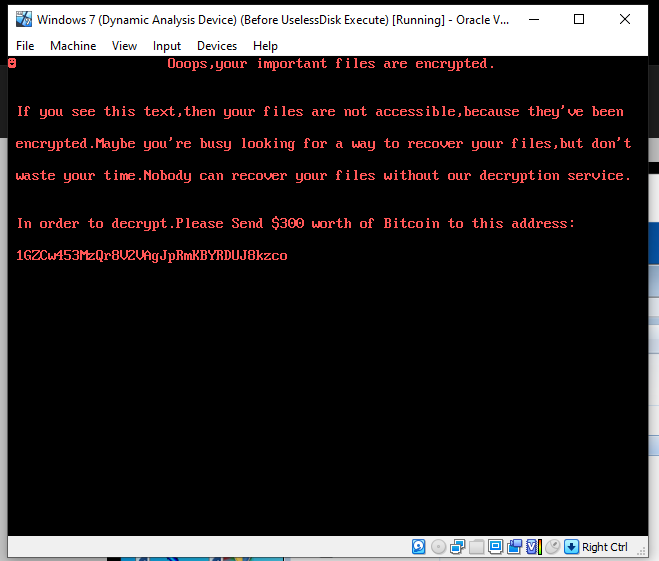
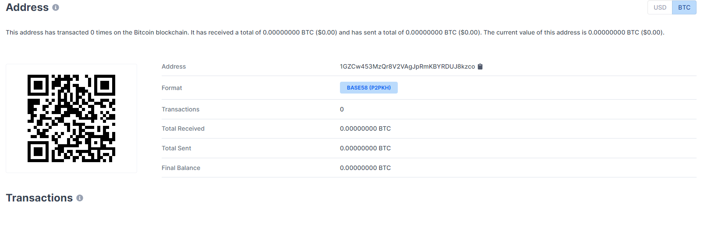
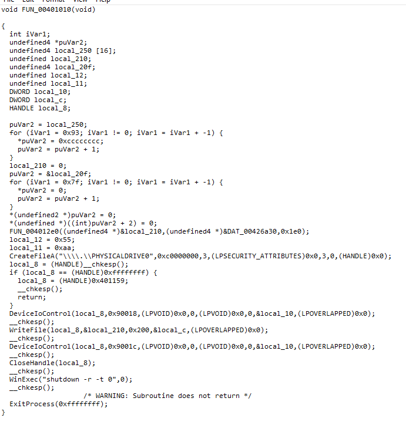
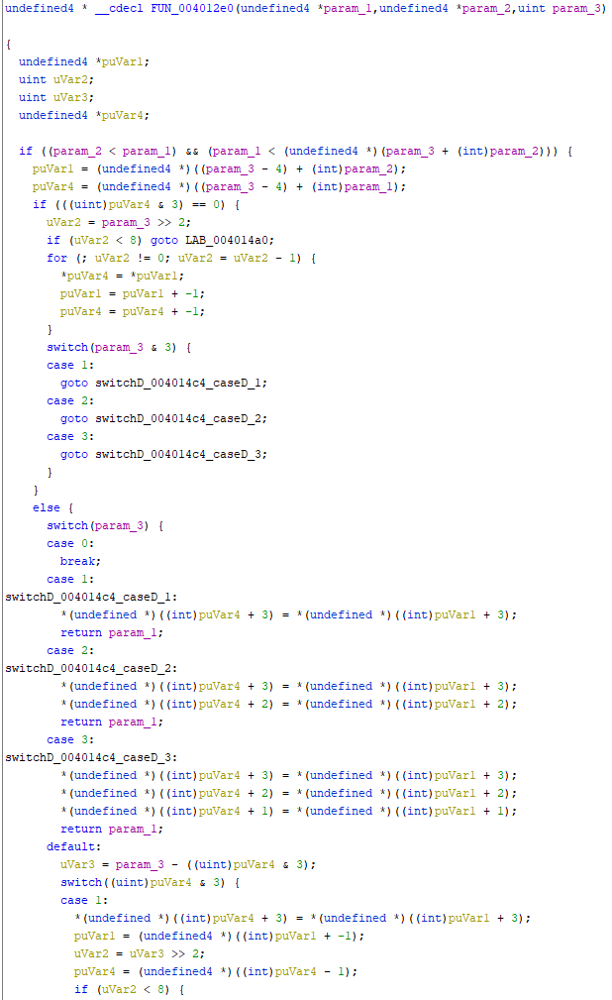
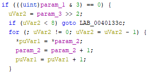
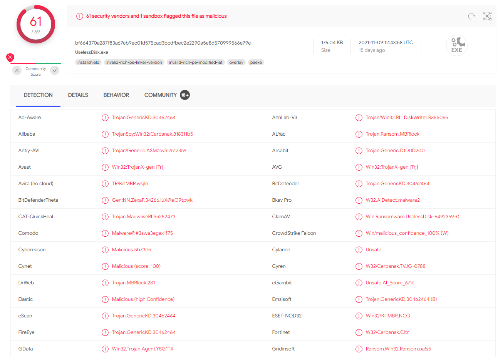

**[Home](/index.html)**

# UselessDisk
## The name says it all.

Written by Martijn van den Berk.

Published on the 25th of November, 2021.

## 1. Introduction
UselessDisk, a piece of malware found running in the Any.Run sandbox. Its victim? A 32-bit Windows 7 system. Identified by its behavior as a piece of ransomware and a locker, it was a prime target for practicing malware analysis given the prevalence of ransomware in today’s environment.

However, as research into the malware progressed it turned out that UselessDisk really does do its name justice. What seemed on the surface to be a nasty piece of ransomware was nothing more than a sheep in wolf’s clothing. Talking the talk, but not walking the walk.

In short, it doesn’t encrypt any files at all. It just overwrites the system’s boot sector with its own malicious boot record which it then boots into on reboot and subsequent boots. More boots here than in a Dr. Martens factory.

## Contents

<dl>
<dt>1. Introduction</dt>
<dt>2. Indicators of compromise</dt>
<dd>2.1. YARA rule</dd>
<dd>2.2. EXE hashes</dd>
<dd>2.3. Sector hashes</dd>
<dd>2.4. Debug hashes</dd>
<dd>2.5. Loaded Libraries</dd>
<dd>2.6. Timestamps</dd>
<dt>3. Mitigation & remediation</dt>
<dd>3.1. Better prevented than cured!</dd>
<dd>3.2. In case of concern</dd>
<dd>3.3. The cure</dd>
<dt>4. Malware summary - A wolf lacking teeth</dt>
<dt>5. Malware deep dive - The little engine that couldn't</dt>
<dd>5.1. The money function</dd>
<dd>5.2. FUN_004012e0</dd>
<dd>5.3. CreateFileA</dd>
<dd>5.4. DeviceIoControl</dd>
<dd>5.5. WriteFile</dd>
<dd>5.6. CloseHandle</dd>
<dd>5.7. WinExec</dd>
<dt>6. Conclusion</dt>
<dd>6.1. Pitroxin.A</dd>
<dd>6.2. The analysis process</dd>
</dl>

## 2. Indicators of compromise

Several indicators that can be used to identify the malware before it has a chance to infect any systems. Including a YARA rule designed to target its primary attack approach, the opening of PHYSICALDRIVE0.

### 2.1. YARA rule

```yara
rule UselessDisk
{
   meta:
      description = "UselessDisk ransomware/locker (Pitroxin.A)"
      date = "2021-11-23"
      version = "1.0"
      in_the_wild = false
      yara_version = ">=4.1.3"
      author = “Martijn van den Berk”
   strings:
      // The Bitcoin address ascociated with the UselessDisk sample that was analyzed
      $bitcoin_address = "1GZCw453MzQr8V2VAgJpRmKBYRDUJ8kzco"

      // The bytes before the main message that are written to the boot record
      $boot_record_header = { B8 12 00 CD 10 BD 18 7C B9 C2 01 B8 01 13 BB 0C 00 BA 00 00 CD 10 E2 FE 02 }

      // Used by the malware in combination to open the first physical drive on the system
      $create_file_a = "CreateFileA"
      $physical_drive_0 = "\\\\.\\PHYSICALDRIVE0"

      // The DeviceIoControl function and the FSCTL_LOCK_VOLUME windows code (in reverse)
      $device_io_control = "DeviceIoControl"
      $dw_io_control_code = { 18 00 09 00 }

      // The message shown to the user upon their system being compromised 
      $warning_message_1 = "ooops,your important files are encrypted." nocase
      $warning_message_2 = "if you see this text,then your files are not ac-cessible,because they've been" nocase
      $warning_message_3 = "encrypted.maybe you're busy looking for a way to recover your files,but don't" nocase
      $warning_message_4 = "waste your time.nobody can recover your files without our decryption service." nocase
      $warning_message_5 = /in order to decrypt\.please send \$\d+ worth of bitcoin to this address\:/ nocase
   condition:
      $bitcoin_address or
      (any of ($warning_message_*)) or
      ($boot_record_header and
      ($create_file_a and $physical_drive_0) and
      ($device_io_control and $dw_io_control_code))
}
```

### 2.2. EXE hashes

| **MD5** | 577BE8C5B73E59FB71570F632349E5FE
| **SHA1** | 363605836BF4EE34D9DFB43A6E71ACDFD2B2CEBE
| **SHA256** | BF664370A287F83A67EB9EC01D575CAD3BCDFBEC2E2290A5E8D570999566E79E

### 2.3. Sector hashes

| **.text MD5** | 25BFFCC7699EE55EE4C26137A0005B80
| **.rdata MD5** | 7CB62907E5066AFA2444938BD533364F
| **.data MD5** | 814984C16EEE7F4655BF39EB6EF4B88B
| **.idata MD5** | B10499704D122E7371784D8860E05A6B
| **.reloc MD5** | EBF0411EA4F5BF3750DF3B2261E1DBAFs

### 2.5. Loaded libraries

- Kernel32.dll

### 2.6. Timestamps

| **Compiler** | 0x5AADE624 | Sat Mar 17 21:08:04 2018
| **Debugger** | 0x5AADE3F3 | Sat Mar 17 20:58:43 2018

## 3. Mitigation & remediation

### 3.1. Better prevented than cured!

Here is a piece of advice to prevent this malware from affecting your system(s).

1. Do **NOT** allow applications to be run in administrator mode.
    - Though of course this is quite an extreme response as sometimes there’s no way around it. Just be sure to stay weary on what you give administrator privileges.
    - The reason this works is because the malware completely relies on opening a handle to PHYSICALDRIVE0, which it can only do with administrator rights.

### 3.2. In case of concern

Should there still be concern an infection may occur, here are some tips that should make recovery of the system far less painful.

1. Make it possible to access the hard disk directly.
    - With virtual machines and the like this is trivial as the hard disk exists as a file on the host system. The malicious boot sector can then be easily overwritten with a valid one.
    - However, for physical machines it’s important to have the proper hardware/software in place to allow for direct reading/writing of the hard disk.
2. Keep a valid boot record at hand.
    - Though it’ll most likely be easy enough to find a proper boot record, taken from a non-infected system, it is handy to keep a valid one easily accessible.
    - This valid boot record can then be used to overwrite the malicious boot record, curing the infection.
3. Full system backups!
    - For this specific malware it may be overkill as it does not actually encrypt any files, but in general it’s a good idea to make regular backups of important systems.
    - It is also advised to store this backup off the system itself. This way it is less likely to be tampered with or become inaccessible (like with this specific malware).

### 3.3. The cure

No, not related to the band. Arguably, this one is better!

Due to the simplistic nature of the malware its effects can be reversed with a few easy steps.

1. Find the location where the malware has overwritten the boot record. This will most likely be the normal location for where the standard Windows boot record is written.
    - If you have direct access to the disk, this will most likely be at sector 0, offset 0. The very start of the disk.
    - In case you don’t have such access (for example if you only have access to the virtual disk or the volume), one way to find it easily is to search for the Bitcoin address. In this sample’s case that’s 1GZCw453MzQr8V2VAgJpRmKBYRDUJ8kzco.
    - The first byte is 0xB8. The whole entry is 512 bytes. It always ends with 0x55 0xAA.
    - For the analysis (on a 64-bit Windows 10 Pro system hosted in VirtualBox) this was at location 2097152, in bytes.
2. Now you’ll need a copy of the normal boot record. You can do this in a few ways. The way I used was to setup a virtual machine with the same operating system and simply take the boot record from there.
    - For the analysis (on a 64-bit Windows 10 Pro system) a specific byte sequence was used. See the addendum for this byte sequence.
3. Finally, simply overwrite the data that was written into the boot record by the malware. Start at the start position and overwrite the 512 bytes.

And now you should have access to your system once again! Almost no files were harmed in the making of this guide. (Poor boot record).

## 4. Malware summary - A wolf lacking teeth

As alluded to in the introduction, this malware is not what it seems to be on the surface.

The malware was run on both a 64-bit Windows 10 and a 32-bit Windows 7 system for testing purposes. The malware behaved the same on both systems.

If run without administrator privileges it does nothing. The reason for this is a call to the CreateFileA function, but more on this later. Once the malware is run with the elevated privileges nothing seems to happen and then the system suddenly restarts.

After the system has restarted, the user is greeted with the following screen. Alerting them of their dire circumstances.



As stated above, it claims that all files have been encrypted and that a decryption service is needed to recover the now inaccessible files. A Bitcoin address is supplied with a request to pay 300 dollars in Bitcoin for the decryption service.



Thankfully though, nobody has seemingly lost any money on this little trickster. That would’ve been a great loss, for none of the files are encrypted.

What the malware does is very simple. It writes the warning message seen above (plus some leading and trailing bytes) to the boot record on the first physical drive of the system (the disk that holds the MBR, as defined by Windows). Thus, when the user boots into the system again they are greeted to this screen instead of their usual Windows environment.

One of the many things that make this malware so silly is that it does not actually encrypt, delete, or otherwise change any data aside from the MBR. It simply overwrites 512 bytes in the boot record so the system displays the message instead of booting into Windows.

Though you may now ask yourself, what exactly does it do? And what other things make it so silly?

Well, do venture on curious reader, as I’ll be shedding light on the malware’s dark and dingy interior.

## 5. Malware deep dive - The little engine that couldn't

For this chapter we will be going in-depth into the exact functioning of the malware.

For static analysis, Ghidra was used on a 64-bit Windows 10 Pro system.

For the dynamic analysis the malware was run with administrator privileges in xDBG32 on a 64-bit Windows 10 Pro system. Without administrator privileges it will attempt to get a READ/WRITE handle to PHYSICALDRIVE0, which is obviously denied, and the malware ends execution upon realizing this. Therefore, xDBG32 was run with administrator privileges.

Just be careful you don’t pass the WriteFile function or your system will be compromised!

Everything found beyond this point is highly technical, so all ye who enter beware!

### 5.1. The money function

The entire malware can essentially be boiled down to this single function.

We will be going through this malware, one function at a time.



### 5.2. FUN_004012e0

The first function we will be looking into is the only interesting, non-Win32 function this malware makes use of.



Now, the screenshot shown above is but a fraction of the complete function. Is it a gigantic amalgamation of IF/ELSE and SWITCH statements.

The inputs it takes are as follows:

1. &local_210
    - The memory address to the variable that will eventually hold the malicious boot record.
2. &DAT_00426a30
    - The memory address in the executable where the malicious boot record is held.
3. 0x1e0
    - The amount of characters to write from the second parameter into the first.

The purpose of this function seems to be to write the data at the DAT_00426a30 memory address to the local_210 memory address.



The FOR statement seen here is tied to the assembly OP MOVSD.REP by Ghidra. REP means it is repeated a set number of times. MOVSD copies a doubleword (2 bytes, the same as a UTF-16 encoded char) from one memory address to another.

The IF statement can be ignored as it doesn’t pass with a param_3 of 1E0.

Though not stated with 100% certainty, this function seems to be very similar to the C++ memcpy function in behavior. Perhaps a custom variant, or an older version. Or maybe one of its many alternatives. It is hard to say, but what can be said is that the behavior is very similar.

### 5.3. CreateFileA

This is a Win32 function from kernel32.dll.

In this case it opens the “\\\\.\\PHYSICALDRIVE0” with READ/WRITE access. PHYSICALDRIVE0 points to the first physical drive as indicated by Windows, which is the drive holding the Windows boot record.

This is also the reason the malware will fail when not running as an administrator. To open the physical drive that holds the boot record, administrator privileges are required.

The 0xC0000000 dwDesiredAccess flag is likely to be a combination of the GENERIC_READ (0x8) and GENERIC_WRITE (0x4) flags. This will allow the handle created by the function to be used for unlimited reading and writing to the physical drive. Which, spoiler alert, will happen later!

The next parameter is the dwShareMode flag. It is likely this is a combination of the FILE_SHARE_READ (0x1) and FILE_SHARE_WRITE (0x2) flags. This is most likely used so no conflicts occur when another process attempts to get access to PHYSICALDRIVE0.

The next parameter is the lpSecurityAttributes field and it is simply null, as it isn’t relevant in this instance.

Then a value of 3 is given to the dwCreationDisposition field and it’s set to 3. This indicates it’s the flag OPEN_EXISTING (0x3), which attempts to open an already existing file. 

Which makes sense, as the physical drive with the boot record is very likely to exist. Would be weird if it didn’t, right?

### 5.4. DeviceIoControl

This function appears twice, and both will be tackled here.

The first parameter, hDevice, is local_8 which is a HANDLE to the first physical drive that is obtained after the CreateFileA function.

The second is the dwIoControlCode, which determines what kind of command is sent to the physical drive. The first call makes use of the 0x90018 flag, which is the FSCTL_LOCK_VOLUME flag and, as the name suggests, locks the volume so no other process can interact with the volume while data is being written to it. The second time it uses the 0x9001C flag, which is the FSCTL_UNLOCK_VOLUME flag, to unlock the volume again. Makes sense so far.

The only other parameter used is a reference to the local_10 memory address, which is to hold the bytes written to the output buffer. Interesting, since the variable isn’t used afterwards. And yes, it is optional.

### 5.5. WriteFile

Now we’ve arrived at the function where it all happens. This is where the malware makes your boot record a right old mess.

The first parameter, hFile, is the local_8 variable again, as it is the HANDLE to the first physical drive.

Then the buffer, a reference to the local_210 memory address, is passed to the function. Remember from before? The non-Win32 function? It is this variable that holds the malicious boot record, and that function wrote it into the variable.

Then a hard coded value, the number of bytes to write. 0x200, which translates to 512 in decimal, and is exactly how large the boot record is in bytes. At least on a Windows machine.

And finally (excluding the unused field) a reference to the local_c memory address to where the number of bytes written are to be written. Lots of writes over here.

### 5.6. CloseHandle

The handle to the first physical drive is closed here. Nothing special. Just some cleanup.

### 5.7. WinExec

And this little function runs the operation “shutdown -r -t 0” which causes the system to reboot immediately.

This is again a reason why the malware is so strange, as there is more code coming after. However, due to this line everything beyond this point is simply ignored.

Even so if it should continue the ExitProcess function is called. This again cuts the malware short as there is more to run after this function. A very strange design choice. Maybe the developers were fans of the “don’t fix if it ain’t broke” school of programming.

## 6. Conclusion

And that is the grand finale of this strange, little piece of malware.

Looking at not just the simplicity of the malware, but also the way the malware was designed, I feel it’s safe to say that either the person who created it is very inexperienced or experimenting with what’s possible.

However, it’s important not to underestimate malware, even one as silly as this. To a person who didn’t invest the time studying the malware’s assembly and operation it very much seems that the files on the system have been encrypted.

This was also my first assumption. Later I found out what was really happening, and I was quite surprised. Especially considering the ease with which system encryption can be implemented. Even back in the prehistoric era known as ‘2018’, during which this malware was allegedly compiled.

Though when push comes to shove, the malware is a nuisance at best. Requiring a tech savvy individual to write a proper boot record to the infected hard drive. That’s all there is to it, thankfully.

### 6.1. Pitroxin.A

What is also quite peculiar is how Windows Defender identified the malware as Pitroxin.A.

Yet, it is very hard to find any information on this specific piece of malware. At least under this name.

It is important to note that according to VirusTotal, this malware has been reported multiple times before. So, it wasn’t made to simply learn or experiment in an isolated environment. It was used and deployed, with the latest submission being in October 2020.



Interestingly, it is sometimes referred to as Carbanak, a notorious APT campaign that targeted banks. Though I highly doubt this fella here got very far with that.

### 6.2. The analysis process

For a thorough description of the analysis process, please see the addendum. In it are contained the steps taken during the analysis, with screenshots.