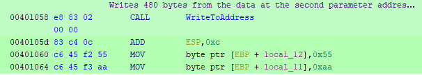

**[Home](/index.html)**

* * *

# UselessDisk
## The name says it all.

Written by Martijn van den Berk.

Published on the 25th of November, 2021.

<div id="introduction"/>

## 1. Introduction
UselessDisk, a piece of malware found running in the Any.Run sandbox. Its victim? A 32-bit Windows 7 system. Identified by its behavior as a piece of ransomware and a locker, it was a prime target for practicing malware analysis given the prevalence of ransomware in today’s environment.

However, as research into the malware progressed it turned out that UselessDisk really does do its name justice. What seemed on the surface to be a nasty piece of ransomware was nothing more than a sheep in wolf’s clothing. Talking the talk, but not walking the walk.

In short, it doesn’t encrypt any files at all. It just overwrites the system’s boot sector with its own malicious boot record which it then boots into on reboot and subsequent boots. More boots here than in a Dr. Martens factory.

## Contents

<div>
    <ol>
        <li><a href="#introduction">Introduction</a></li>
        <li><a href="#running-the-malware">Running the malware - A wolf lacking teeth</a></li>
        <li><a href="#malware-analysis">Malware analysis - The little engine that couldn't</a>
            <ol style="margin-bottom: 0px">
                <li><a href="#the-money-function">The money function</a></li>
                <li><a href="#fun_004012e0">FUN_004012e0</a></li>
                <li><a href="#createfilea">CreateFileA</a></li>
                <li><a href="#deviceiocontrol">DeviceIoControl</a></li>
                <li><a href="#writefile">WriteFile</a></li>
                <li><a href="#closehandle">CloseHandle</a></li>
                <li><a href="#winexec">WinExec</a></li>
            </ol>
        </li>
        <li><a href="the-mbr">The MBR</a></li>
        <li><a href="#conclusion">Conclusion</a>
            <ol style="margin-bottom: 0px">
                <li><a href="#pitroxin.a">Pitroxin.A</a></li>
                <li><a href="#the-analysis-process">The analysis process</a></li>
            </ol>
        </li>
        <li><a href="#the-cure">The cure</a></li>
        <li><a href="#indicators-of-compromise">Indicators of compromise</a>
            <ol style="margin-bottom: 0px">
                <li><a href="#yara-rule">YARA rule</a></li>
            </ol>
        </li>
    </ol>
</div>

<div id="running-the-malware"/>

## 2. Running the malware - A wolf lacking teeth

As alluded to in the introduction, this malware is not what it seems to be on the surface.

The malware was run on both a 64-bit Windows 10 and a 32-bit Windows 7 system for testing purposes. The malware behaved the same on both systems.

If run without administrator privileges it does nothing. The reason for this is a call to the CreateFileA function, but more on this later. Once the malware is run with the elevated privileges nothing seems to happen and then the system suddenly restarts.

After the system has restarted, the user is greeted with the following screen. Alerting them of their dire circumstances.


As stated above, it claims that all files have been encrypted and that a decryption service is needed to recover the now inaccessible files. A Bitcoin address is supplied with a request to pay 300 dollars in Bitcoin for the decryption service.


Thankfully though, nobody has lost any money on this little trickster. That would’ve been unfortunate, for none of the files are encrypted.

What the malware does is very simple. It writes the warning message seen above (plus some leading and trailing bytes) to the boot record on the first physical drive of the system (the disk that holds the MBR, as defined by Windows). Thus, when the user boots into the system again they are greeted to this screen instead of their usual Windows environment.

One of the many things that make this malware so silly is that it does not actually encrypt, delete, or otherwise change any data aside from the MBR. It simply overwrites 512 bytes in the boot record so the system displays the message instead of booting into Windows.

Though you may now ask yourself, what exactly does it do? And what other things make it so silly?

Well, do venture on curious reader, as I’ll be shedding light on the malware’s dark and dingy interior.

<div id="malware-analysis"/>

## 3. Malware analysis - The little engine that couldn't

For this chapter we will be going in-depth into the exact functioning of the malware.

For static analysis, Ghidra was used on a 64-bit Windows 10 Pro system.

For the dynamic analysis the malware was run with administrator privileges in xDBG32 on a 64-bit Windows 10 Pro system.

Everything found beyond this point is highly technical, so all ye who enter beware!

### 3.1. Entry into orbit


Here we see the entry point of the application.

This function on its own is not terribly interesting, as every function above LockComputer is simply used to load in necessary dependencies. Which includes kernel32.dll.

As all of this is standard Windows application behaviour I will not be covering this.

Instead we will be moving onto the LockComputer function, which is where all the magic happens.

### 3.1. The money function


The entire malware can essentially be boiled down to this single function.

A single function still appears underneath what we can see, but this is just an ExitProcess call. Besides, this line is never reached, as we'll touch upon later.

The WriteToAddress function is a custom function that we will be covering more in-depth below.

#### 3.2. WriteToAddress


The WriteToAddress function, the only non-Win32 function used within the LockComputer function.

And what does this mysterious function do? It writes data from one address space to another.

For the sake of ease, one can think of this as a bootleg memcpy function.

The inputs it takes are as follows:

<div>
    <ol>
        <li>array1Addr
            <ul>
                <li>The memory address to which to write.</li>
            </ul>
        </li>
        <li>array2Addr
            <ul>
                <li>The memory address from which to read.</li>
            </ul>
        </li>
        <li>bytesToWrite
            <ul>
                <li>The amount of bytes to write from array2Addr into array1Addr.</li>
            </ul>
        </li>
    </ol>
</div>


Here we see the one part of the function that actually does something. At least for our malware, due to the hardcoded value of 0x1E0 for bytesToWrite.

It simply copies bytes from array2Addr into array1Addr. Don't be fooled by tempArray1Addr, exactly the same happens if the function did not use this variable and just wrote to array1Addr directly.

Now, let's take a look at how this function is used within the LockComputer function.


Here we can see that maliciousBootRecordAddr, DAT_maliciousBootRecordAddr, and 480 are passed to this function.

<div>
    <ol>
        <li>maliciousBootRecordAddr
            <ul>
                <li>The address where to store the malicious boot record.</li>
            </ul>
        </li>
        <li>DAT_maliciousBootRecordAddr
           <ul>
                <li>The global variable and the address where the malicious boot record is stored in the application.</li>
            </ul>
        </li>
        <li>480
            <ul>
                <li>The amount of bytes to write from the second parameter to the first.</li>
            </ul>
        </li>
    </ol>
</div>

The one thing to note is how 480 bytes are written, instead of the MBR boot record size of 512 bytes. The reason for this that the malicious boot record is 468 bytes in size, so no more has to be written. The extra 12 bytes don't matter to the MBR if they are zero. The only other thing that matters is what we see right underneath.

local_12 and local_11 have the values 0x55 and 0xAA written into them. The reason for this is that every MBR boot record must end with 0x55 and 0xAA.

By simply assigning these two variables, they are placed in the correct memory addresses. We can see this in the assembly. Quite interesting how memory is aligned so things work out this way.




Now that we have the malicious boot record in order it's time to start preparing to write to it!

#### 3.3. CreateFileA


Here we see the Win32 function CreateFileA in action.

It's used to retrieve a HANDLE to the PHYSICALDRIVE0, which is the first physical drive defined by Windows. And it just so happens that Windows decides this disk is the one holding the boot record, which makes this malware a very happy one indeed.

This function is also the reason why the malware appears to do nothing when it's run without administrator privileges.

As can be seen, if the hPhysicalDrive0 is an INVALID_HANDLE_VALUE the program terminates.

#### 3.4. DeviceIoControl


This function appears twice, and both will be tackled here.

This is another Win32 function supplied by Kernel32.dll.

It allows one to send message directly to devices, which can then execute on it.

The inputs it takes is as follows:

<div>
    <ol>
        <li>hPhysicalDrive0
            <ul>
                <li>This is the HANDLE to the PHYSICALDRIVE0..</li>
            </ul>
        </li>
        <li>FSCTL_LOCK_VOLUME/FSCTL_UNLOCK_VOLUME
           <ul>
                <li>This is the message that is sent to the device. In this case it first asks to lock the volume before writing, and then unlocks it again after.</li>
            </ul>
        </li>
        <li>&bDeviceIoControlOutput
            <ul>
                <li>This is a memory address where the amount of bytes in the output buffer is written to.</li>
            </ul>
        </li>
    </ol>
</div>

The one interesting thing here is that the parameter &bDeviceIoControlOutput is optional. It is also not used since no output buffer is defined (which would be the second NULL parameter). The variable also remains unused.

#### 3.5. WriteFile


Here we see the third Win32 function used by LockComputer, WriteFile.

1. hPhysicalDrive0
    - The HANDLE to the PHYSICALDRIVE0.
2. &maliciousBootRecordAddr
    - The address where the malicious boot record is stored.
3. 512
    - The amount of bytes to write.
4. &bWriteFileOutput
    - The address where to write the amount of bytes written by the function.

As this is the first time any writing is done to the file it will write this information starting at position 0. It will then overwrite the next 512 bytes with the malicious boot record. This 512 byte size is the exact size of a MBR boot record.

Once this function has run your device is infected.

It finishes with calling the second DeviceIoControl (as described above), does some cleanup and restarts the host device.

#### 3.6. CloseHandle


The handle to the first physical drive is closed here. Nothing special. Just some cleanup.

#### 3.7. WinExec


And this little function runs the operation “shutdown -r -t 0” which causes the system to reboot immediately.

### 3.8. The forgotten function


Interestingly, another function to end the process follows after the WinExec that shuts the system down.

The reason for this is that if the WinExec function fails to execute for whatever reason (privilege issues, for example) it will still close the application then and there.

Better safe than sorry, eh?

## 4. The MBR

Now, since this malware is completely focused on infecting an MBR boot record we will be taking a look at the changes it makes.

## 5. Conclusion

And that is the grand finale of this strange, little piece of malware.

Looking at not just the simplicity of the malware, but also the way the malware was designed, I feel it’s safe to say that either the person who created it is very inexperienced or experimenting with what’s possible. Didn't care, maybe? What about a lack of time to develop the malware further? Many different possibilities.

I like to think whoever made it went for a hot dog and left their PC unlocked, only to have a colleague trying to pull a prank but accidentally upload the malware. Perhaps one day we will know.

However, it’s important not to underestimate malware, even one as silly as this. To a person who didn’t invest the time studying the malware’s assembly and operation it very much seems that the files on the system have been encrypted.

This was also my first assumption. Later I found out what was really happening, and I was quite surprised. Especially considering the ease with which system encryption can be implemented. Even back in the prehistoric era known as ‘2018’, during which this malware was allegedly compiled.

It may very well be that a company panics and wishes to solve the problem quickly, so they could choose to pay the $300 decryptor price. There is a lack of a deadline, however, unlike many contemporary malware threats, there isn't much of an aggressive push towards companies to hurry and get their files decrypted. The likelihood of this malware succeeding were rather low from the start.

The malware, in truth, is a nuisance at best. Requiring a tech savvy individual to write a proper boot record to the infected hard drive. That’s all there is to it, thankfully.

### 5.1. Pitroxin.A

What is also quite peculiar is how Windows Defender identified the malware as Pitroxin.A.

Yet, it is very hard to find any information on this specific piece of malware. At least under this name.

It is important to note that according to VirusTotal, this malware has been reported multiple times before. So, it wasn’t made to simply learn or experiment in an isolated environment. It was used and deployed, with the latest submission being in October 2020.


Interestingly, it is sometimes referred to as Carbanak, a notorious APT campaign that targeted banks. Though I highly doubt this fella here got very far with that.

### 5.2. The analysis process

For a thorough description of the analysis process, please see the addendum. In it are contained the steps taken during the analysis, with screenshots.

## 6. The cure

No, not related to the band. Arguably, this one is better!

Due to the simplistic nature of the malware its effects can be reversed with a few easy steps.

1. Find the location where the malware has overwritten the boot record. This will most likely be the normal location for where the standard Windows boot record is written.
    - If you have direct access to the disk, this will most likely be at sector 0, offset 0. The very start of the disk.
    - In case you don’t have such access (for example if you only have access to the virtual disk or the volume), one way to find it easily is to search for the Bitcoin address. In this sample’s case that’s 1GZCw453MzQr8V2VAgJpRmKBYRDUJ8kzco.
    - The first byte is 0xB8. The whole entry is 512 bytes. It always ends with 0x55 0xAA.
    - For the analysis (on a 64-bit Windows 10 Pro system hosted in VirtualBox) this was at location 2097152, in bytes.
2. Now you’ll need a copy of the normal boot record. You can do this in a few ways. The way I used was to setup a virtual machine with the same operating system and simply take the boot record from there.
    - For the analysis (on a 64-bit Windows 10 Pro system) a specific byte sequence was used. See the addendum for this byte sequence.
3. Finally, simply overwrite the data that was written into the boot record by the malware. Start at the start position and overwrite the 512 bytes.

And now you should have access to your system once again! Almost no files were harmed in the making of this guide. (Poor boot record).

## 7. Indicators of compromise

Several indicators that can be used to identify the malware before it has a chance to infect any systems. Including a YARA rule designed to target its primary attack approach, the opening of PHYSICALDRIVE0.

### 7.1. YARA rule

```yara
rule UselessDisk
{
   meta:
      description = "UselessDisk ransomware/locker (Pitroxin.A)"
      date = "2021-11-23"
      version = "1.0"
      in_the_wild = false
      yara_version = ">=4.1.3"
      author = “Martijn van den Berk”
   strings:
      // The Bitcoin address associated with the UselessDisk sample that was analyzed
      $bitcoin_address = "1GZCw453MzQr8V2VAgJpRmKBYRDUJ8kzco"

      // The bytes before the main message that are written to the boot record
      $boot_record_header = { B8 12 00 CD 10 BD 18 7C B9 C2 01 B8 01 13 BB 0C 00 BA 00 00 CD 10 E2 FE 02 }

      // Used by the malware in combination to open the first physical drive on the system
      $create_file_a = "CreateFileA"
      $physical_drive_0 = "\\\\.\\PHYSICALDRIVE0"

      // The DeviceIoControl function and the FSCTL_LOCK_VOLUME windows code (in reverse)
      $device_io_control = "DeviceIoControl"
      $dw_io_control_code = { 18 00 09 00 }

      // The message shown to the user upon their system being compromised 
      $warning_message_1 = "ooops,your important files are encrypted." nocase
      $warning_message_2 = "if you see this text,then your files are not accessible,because they've been" nocase
      $warning_message_3 = "encrypted.maybe you're busy looking for a way to recover your files,but don't" nocase
      $warning_message_4 = "waste your time.nobody can recover your files without our decryption service." nocase
      $warning_message_5 = /in order to decrypt\.please send \$\d+ worth of bitcoin to this address\:/ nocase
   condition:
      $bitcoin_address or
      (any of ($warning_message_*)) or
      ($boot_record_header and
      ($create_file_a and $physical_drive_0) and
      ($device_io_control and $dw_io_control_code))
}
```
