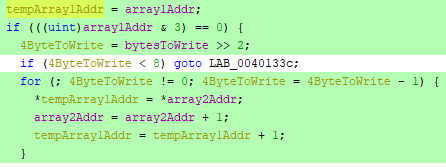
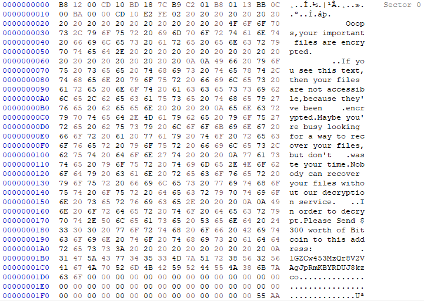
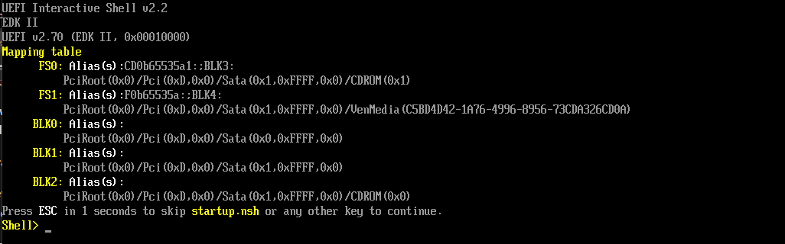

**[Home](/index.html)**

* * *

# UselessDisk
## The name says it all.

Written by Martijn van den Berk.

Published on the 25th of November, 2021.

<div id="introduction"/>

## 1. Introduction
UselessDisk, a piece of malware found running in the Any.Run sandbox. Its victim? A 32-bit Windows 7 system. Identified by its behavior as a piece of ransomware and a locker, it was a prime target for practicing malware analysis given the prevalence of ransomware in today’s environment.

However, as research into the malware progressed it turned out that UselessDisk really does do its name justice. What seemed on the surface to be a nasty piece of ransomware was nothing more than a sheep in wolf’s clothing. Talking the talk, but not walking the walk.

In short, it doesn’t encrypt any files at all. It just overwrites the system’s boot sector with its own malicious boot record which it then boots into on reboot and subsequent boots. More boots here than in a Dr. Martens factory.

## Contents

<section>
    <ol>
        <li><a href="#introduction">Introduction</a></li>
        <li><a href="#running-the-malware">Running the malware - A wolf lacking teeth</a></li>
        <li><a href="#malware-analysis">Malware analysis - The little engine that couldn't</a>
            <ol>
                <li><a href="#entry-into-orbit">Entry into orbit</a></li>
                <li><a href="#lockcomputer">LockComputer</a></li>
                <li><a href="#writetoaddress">WriteToAddress</a></li>
                <li><a href="#createfilea">CreateFileA</a></li>
                <li><a href="#deviceiocontrol">DeviceIoControl</a></li>
                <li><a href="#writefile">WriteFile</a></li>
                <li><a href="#closehandle">CloseHandle</a></li>
                <li><a href="#winexec">WinExec</a></li>
                <li><a href="#the-forgotten-function">The forgotten function</a></li>
            </ol>
        </li>
        <li><a href="#the-boot">The boot</a>
            <ol>
                <li><a href="#but-why">But why?</a></li>
            </ol>
        </li>
        <li><a href="#conclusion">Conclusion</a>
            <ol>
                <li><a href="#virustotal">VirusTotal</a></li>
                <li><a href="#ransomware">Ransomware?</a></li>
                <li><a href="#the-analysis-process">The analysis process</a></li>
            </ol>
        </li>
        <li><a href="#the-cure">The cure</a></li>
        <li><a href="#indicators-of-compromise">Indicators of compromise</a>
            <ol>
                <li><a href="#hashes">Hashes</a></li>
                <li><a href="#yara-rule">YARA rule</a></li>
            </ol>
        </li>
    </ol>
</section>

<div id="running-the-malware"/>

## 2. Running the malware - A wolf lacking teeth

As alluded to in the introduction, this malware is not what it seems to be on the surface.

The malware was run on both a 64-bit Windows 10 and a 32-bit Windows 7 system for testing purposes. The malware behaved the same on both systems.

If run without administrator privileges it does nothing. The reason for this is a call to the CreateFileA function, but more on this later. Once the malware is run with the elevated privileges nothing seems to happen and then the system suddenly restarts.

After the system has restarted, the user is greeted with the following screen. Alerting them of their dire circumstances.


As stated above, it claims that all files have been encrypted and that a decryption service is needed to recover the now inaccessible files. A Bitcoin address is supplied with a request to pay 300 dollars in Bitcoin for the decryption service.


Thankfully though, nobody has lost any money on this little trickster. That would’ve been unfortunate, for none of the files are encrypted.

What the malware does is very simple. It writes the warning message seen above (plus some leading and trailing bytes) to the boot record on the first physical drive of the system (the disk that holds the MBR, as defined by Windows). Thus, when the user boots into the system again they are greeted to this screen instead of their usual Windows environment.

One of the many things that make this malware so silly is that it does not actually encrypt, delete, or otherwise change any data. Aside from the first 512 bytes in the MBR so the system displays the message instead of booting into Windows.

Though you may now ask yourself, what exactly does it do? And what other things make it so silly?

Well, do venture on curious reader, as I’ll be shedding light on the malware’s dark and dingy interior.

<div id="malware-analysis"/>

## 3. Malware analysis - The little engine that couldn't

For this chapter we will be going in-depth into the exact functioning of the malware.

For static analysis, Ghidra was used on a 64-bit Windows 10 Pro system.

For the dynamic analysis the malware was run with administrator privileges in xDBG32 on a 64-bit Windows 10 Pro system.

Everything found beyond this point is highly technical, so all ye who enter beware!

<div id="entry-into-orbit"/>

### 3.1. Entry into orbit


Here we see the entry point of the application.

This function on its own is not terribly interesting, as every function above LockComputer is simply used to load in necessary dependencies. Which includes Kernel32.dll.

I will not be covering this as its all standard Windows application behavior. 

Instead we will be moving onto the LockComputer function, which is where all the magic happens.

<div id="lockcomputer"/>

### 3.2. LockComputer


The entire malware can essentially be boiled down to this single function.

A sole function still appears underneath what we can see, but this is just an ExitProcess call. Besides, this line is never reached during normal execution, and we'll touch upon it later.

This report will be covering all the highlighted lines, starting with the WriteToAddress function.

<div id="writetoaddress"/>

### 3.3. WriteToAddress


The screenshot above shows only part of the massive amalgamation of IF, ELSE, and SWITCH statements.

The WriteToAddress function, the only non-Win32 function used within the LockComputer function to be exact.

And what does this mysterious function do? It writes data from one address space to another.

For the sake of ease, one can think of this as a bootleg memcpy function.

The inputs it takes are as follows:

<section>
    <ol>
        <li>array1Addr
            <ul>
                <li>The memory address to which to write.</li>
            </ul>
        </li>
        <li>array2Addr
            <ul>
                <li>The memory address from which to read.</li>
            </ul>
        </li>
        <li>bytesToWrite
            <ul>
                <li>The amount of bytes to write from the address space at array2Addr into the address space at array1Addr.</li>
            </ul>
        </li>
    </ol>
</section>



Here we see the one part of the function that actually does something. At least for our malware. Due to the hardcoded value of 0x1E0 (480 in decimal) it passes all the IF/ELSE and SWITCH statements, never causing a TRUE value to occur.

This FOR loop simply copies bytes from the address space at array2Addr into the address space at array1Addr. Don't be fooled by tempArray1Addr. The same happens if the function did not use this variable and just wrote to array1Addr directly.

Now, let's take a look at how this function is used within the LockComputer function.


Here we can see that maliciousBootRecordAddr, DAT_maliciousBootRecordAddr, and 480 are passed to this function.

<section>
    <ol>
        <li>maliciousBootRecordAddr
            <ul>
                <li>The address where to store the malicious boot record.</li>
            </ul>
        </li>
        <li>DAT_maliciousBootRecordAddr
            <ul>
                <li>A global variable and the address where the malicious boot record is stored in the application.</li>
            </ul>
        </li>
        <li>480
            <ul>
                <li>The amount of bytes to write.</li>
            </ul>
        </li>
    </ol>
</section>

The one thing to note is how 480 bytes are written, instead of the standard MBR size of 512 bytes. The reason for this that the malicious boot record is 468 bytes in size, so no more must be written. The extra 12 bytes don't matter to the MBR if they are zero. The only other thing that matters is what we see right underneath. What is done with the remaining 32 bytes is covered below.

local_12 and local_11 have the values 0x55 and 0xAA written into them. The reason for this is that every MBR must end with 0x55 and 0xAA.

By simply assigning these two variables, they are placed in the correct memory addresses. We can see this in the assembly. Quite interesting how memory is aligned so things work out this way.


Now for the explaining.

Firstly it writes the 480 bytes into the address space as specified by the maliciousBootRecordAddr parameter (the first parameter).

Then, by having the WriteToAddress function return the address, the EDI register (which points at where the next bytes are to be written on the stack) is incremented by 32.

Why 32? Because we're running in a 32-bit environment and addresses are 32 bytes in size!

So even if the return value is not used, which it isn't, it still contributes to making the whole thing work! Pretty nifty.

It then writes the bytes to EBP + local_12 and EBP + local_11. These values are such, during execution, that they will write over the final two bytes to finish the malicious boot record.


Now that we have the malicious boot record in order it's time to start preparing to write to it!

<div id="createfilea"/>

### 3.4. CreateFileA


Here we see the Win32 function CreateFileA in action.

It takes the following parameters:

<section>
    <ol>
        <li>"\\\\.\\PHYSICALDRIVE0"
            <ul>
                <li>This tells the function that the first physical drive (as defined by Windows) is to be opened.</li>
            </ul>
        </li>
        <li>GENERIC_READ | GENERIC_WRITE
            <ul>
                <li>Open the file with read and write access.</li>
            </ul>
        </li>
        <li> FILE_SHARE_READ | FILE_SHARE_WRITE
            <ul>
                <li>Make sure that others can still read and write to the drive.</li>
            </ul>
        </li>
        <li> OPEN_EXISTING
            <ul>
                <li>And tell the function it's opening an existing file. Would be very weird if PHYSICALDRIVE0 does not exist...</li>
            </ul>
        </li>
    </ol>
</section>

The as stated above, PHYSICALDRIVE0 refers to the first physical drive. This drive is defined by Windows to be the drive holding the boot record. It is this that makes the malware very happy.

Yet this function is also the reason why the malware appears to do nothing when it's run without administrator privileges.

As can be seen, if the hPhysicalDrive0 is an INVALID_HANDLE_VALUE the program terminates. And it needs administrator privileges to open the PHYSICALDRIVE0 with read and write access.

<div id="deviceiocontrol"/>

### 3.5. DeviceIoControl


This function appears twice, and both will be tackled here.

This is another Win32 function supplied by Kernel32.dll.

It allows one to send message directly to devices, which can then execute on it.

The inputs it takes are as follows:

<section>
    <ol>
        <li>hPhysicalDrive0
            <ul>
                <li>This is the HANDLE to the PHYSICALDRIVE0.</li>
            </ul>
        </li>
        <li>FSCTL_LOCK_VOLUME/FSCTL_UNLOCK_VOLUME
            <ul>
                <li>This is the message that is sent to the device. In this case it first asks to lock the volume before writing, and then unlocks it again after.</li>
            </ul>
        </li>
        <li>&bDeviceIoControlOutput
            <ul>
                <li>This is a memory address where the amount of bytes in the output buffer is written to.</li>
            </ul>
        </li>
    </ol>
</section>

The one interesting thing here is that the parameter &bDeviceIoControlOutput is optional. It is also not used since no output buffer is defined (which would be the second NULL parameter).

<div id="writefile"/>

### 3.6. WriteFile


Here we see the third Win32 function used by LockComputer, WriteFile.

<section>
    <ol>
        <li>hPhysicalDrive0
            <ul>
                <li>The HANDLE to the PHYSICALDRIVE0.</li>
            </ul>
        </li>
        <li>&maliciousBootRecordAddr
            <ul>
                <li>The address where the malicious boot record is stored.</li>
            </ul>
        </li>
        <li>512
            <ul>
                <li>The amount of bytes to write.</li>
            </ul>
        </li>
        <li>&bWriteFileOutput
            <ul>
                <li>The address where to write the amount of bytes written by the function.</li>
            </ul>
        </li>
    </ol>
</section>

As this is the first time any writing is done to the file it will write this information starting at position 0. It will then overwrite the next 512 bytes with the malicious boot record. This 512 byte size is the exact size of a MBR.

Once this function has run your device is infected.

After this function it calls the second DeviceIoControl function, as described above.

<div id="closehandle"/>

### 3.7. CloseHandle


The handle to the first physical drive is closed here. Nothing special. Just some cleanup.

<div id="winexec"/>

### 3.8. WinExec


And this little function runs the operation “shutdown -r -t 0” which causes the system to reboot immediately.

<div id="the-forgotten-function"/>

### 3.9. The forgotten function


Interestingly, another function to end the process follows the WinExec that shuts the system down.

The reason for this is that if the WinExec function fails to execute for whatever reason (privilege issues, for example) it will still close the application then and there.

Better safe than sorry, eh?

<div id="the-boot"/>

## 4. The boot

Now, since this malware is completely focused on infecting a boot record, we will be taking a look at the changes it makes. And some quirks it has.


Above us we see a MBR at the start of the disk. Sector 0 with an offset of 0 bytes.



And here we see the same boot record, but infected. The easiest way to see the change is by looking at the ASCII text to the right. As we can see, the boot record has been overwritten and the device can no longer boot into Windows.


Here we see the first sector of a healthy GPT boot record. Notice how much different it is as compared to MBR.


And here we see an infected first sector of a GPT boot record.

The malware has, as per its design, overwritten the first 512 bytes of the physical disk with the malicious boot record it holds. However, GPT does not work in this manner. Or, rather, UEFI does not work in this manner.



This is what happens when we boot into the device (with UEFI enabled). Since it cannot boot using the boot record on the hard drive it puts us into this shell where we can perform some very basic commands.

Now, to get some confusion out of the way, it isn't MBR or GPT that is messing things up. Those are just different ways that boot records (and some other stuff such as how file information is stored) is handled. The real culprit is the way the firmware is attempting to boot the system.

There are two ways for a system to boot. Two of the most common ways, at least. BIOS and UEFI. (EFI has been deprecated for UEFI, but it sort of works the same, so we'll just refer to UEFI here).

BIOS knows just about what hard disks there are and from what disk the system must boot. It will fire up the first 512 bytes on that disk and that's it. The BIOS has done its job and will no longer be involved in the rest of the process. Therefore, the malware works when booting via BIOS.

UEFI on the other hand works differently. I will not go into how exactly it works, but it's not nearly the same. The only way this malware would work with UEFI is if BIOS style booting has been enabled. Though this option may not even be available depending on firmware.

MBR/BIOS and GPT/UEFI are very closely linked to one another. Therefore, it's fair to say that the malware only works with MBR, but technically it's the firmware who's to blame.

<div id="but-why"/>

### 4.1. But why?

This is going heavy into speculation territory. Many assumptions are made as well. So, in case you're not interested I would skip this part.

Even if you are interested, do your own research too! There are many misconceptions about MBR/GPT/BIOS/UEFI and before looking into this deeper I fell for many myself.

Though as I was saying, I have a hunch as to why this malware is designed to exclusively work with BIOS.

Considering the malware was created in 2018 (proof of this can be seen in the conclusion below) and targeted Windows 7 machines it is very likely that UEFI was not at all of concern to the developers. Windows 7 is quite messy to get working with UEFI style booting. And there weren't many devices that solely relied on UEFI boot. At least as compared to today. Hell, even today most UEFI systems still allow the option to set BIOS style booting.

I think that because the target systems are exclusively Windows (Windows 7 in particular) and since UEFI booted Windows 7 systems were much rarer there wasn't a big reason to implement UEFI compatibility.

Especially considering how much different UEFI is as compared to BIOS. BIOS simply reads the first 512 bytes. UEFI has a whole process it goes through before booting. It'd require far more work (relatively speaking) to implement something like that for potentially very little gain.

Therefore, I believe there was never a desire to implement UEFI compatibility. At least not yet.

<div id="conclusion"/>

## 5. Conclusion

And that is the grand finale of this strange, little piece of malware.

Harmless as it may be to any person with sufficient technical knowledge, it should not be underestimated. When it first booted, I too thought it had encrypted my files and I had a dangerous piece of ransomware on my hands. It was only after digging into the functioning of the malware that I was convinced of the contrary.

An individual could very well fall for this piece of malware and choose to pay the $300 for the decryptor out of sheer panic and lack of technical know-how.

The malware, in truth, is a nuisance at best. Requiring a tech savvy individual to write a proper boot record to the infected hard drive. That’s all there is to it, thankfully.

<div id="virustotal"/>

### 5.1. VirusTotal

Searching the malware on VirusTotal gives us several results, indicating that the malware has indeed been found and reported before.


Here we can also see that the malware was first submitted in 2018. Therefore, it is safe to assume the given creation date of March 2018 is also correct and not spoofed afterwards.

<div id="ransomware"/>

### 5.3. Ransomware?

Another point I personally find interesting is how it is tagged. Microsoft Defender and Any.Run have identified it as being ransomware. Despite this not being the case since it does not actually encrypt any files. It's a locker at best.

Though one can argue about what it means to be 'ransomware', I would have to agree with the definition given by [CISA](https://www.cisa.gov/stopransomware) (The Cybersecurity and Infrastructure Agency of the United States) that its primary method of making files unavailable is through encryption.


False positives are the culprit here. Triggered by the locker behavior of the malware it is assumed that it also hides ransomware functionality, even though it does not.

Yet another good reason to be on the lookout for them. And I would certainly advise anyone who creates signatures to be careful with what classifications they assign to malware.

<div id="the-analysis-process"/>

### 5.4. The analysis process

For a thorough description of the analysis process, please see the [addendum](./uselessdiskaddendum.md#the-process). In it are contained the steps taken during the analysis, with screenshots.

This is intended for those who wish to see each step taken during the process of malware analysis. Much of the information found here is repeated there, but information that was considered unimportant for this report was left out. This can be found in the [addendum](./uselessdiskaddendum.md#the-process).

<div id="the-cure"/>

## 6. The cure

No, not related to the band. Arguably, this one is better!

Due to the simplistic nature of the malware its effects can be reversed with a few easy steps.

This works for both MBR and GPT configured systems, as the malware always only writes over the first 512 bytes.

<section>
    <ol>
        <li>Find the location where the malware has overwritten the boot record. This is at the normal location for where the standard Windows boot record is written.
            <ul>
                <li>If you have direct access to the disk, this is at sector 0, offset 0. The very start of the disk.</li>
                <li>In case you don’t have such access (for example if you only have access to the virtual disk or the volume), one way to find it easily is to search for the Bitcoin address. In this sample’s case that’s 1GZCw453MzQr8V2VAgJpRmKBYRDUJ8kzco.</li>
                <li>The first byte is 0xB8. The whole entry is 512 bytes. It always ends with 0x55 0xAA.</li>
                <li>For the analysis (on a 64-bit Windows 10 Pro system hosted in VirtualBox) this was at location 2097152, in bytes.</li>
            </ul>
        </li>
        <li>Now you’ll need a copy of the normal boot record. You can do this in a few ways. The way I used was to setup a virtual machine with the same operating system and simply take the boot record from there.
            <ul>
                <li>For the analysis (on a 64-bit Windows 10 Pro system) a specific byte sequence was used. See the <a href="./uselessdiskaddendum.html#valid-windows-10-pro-boot-record">addendum</a> for this byte sequence. Both a valid MBR and GPT sector 0 can be found here.</li>
            </ul>
        </li>
        <li>Finally, simply overwrite the data that was written into the boot record by the malware. Start at the start position and overwrite the 512 bytes.</li>
    </ol>
</section>

And now you'll have access to your system once again! Almost no files were harmed in the making of this guide. (Poor boot record).

<div id="indicators-of-compromise"/>

## 7. Indicators of compromise

Several indicators that can be used to identify the malware before it has a chance to infect any systems. Including a YARA rule designed to target its primary attack approach, the opening of PHYSICALDRIVE0.

<div id="hashes"/>

### 7.1. Hashes

MD5, SHA-1, SHA-256, and Fuzzy hashes taken from [VirusTotal](https://www.virustotal.com/gui/file/bf664370a287f83a67eb9ec01d575cad3bcdfbec2e2290a5e8d570999566e79e).

| MD5 | 577be8c5b73e59fb71570f632349e5fe

| SHA-1 | 363605836bf4ee34d9dfb43a6e71acdfd2b2cebe

| SHA-256 | bf664370a287f83a67eb9ec01d575cad3bcdfbec2e2290a5e8d570999566e79e

| Fuzzy | 1536:wNx32nZ7n9Ji4+IrLFAAi524020CVdDATOwt77X0goavwiv:w/2nR9Ji4+IrLW240FCVBATEgoavP,"UselessDisk.bin"

<div id="yara-rule"/>

### 7.2. YARA rule

```yara
rule UselessDisk
{
   meta:
      description = "UselessDisk locker"
      date = "2021-11-23"
      version = "1.0"
      in_the_wild = true
      yara_version = ">=4.1.3"
      author = “Martijn van den Berk”
   strings:
      // The Bitcoin address associated with the UselessDisk sample that was analyzed
      $bitcoin_address = "1GZCw453MzQr8V2VAgJpRmKBYRDUJ8kzco"

      // The bytes before the main message that are written to the boot record
      $boot_record_header = { B8 12 00 CD 10 BD 18 7C B9 C2 01 B8 01 13 BB 0C 00 BA 00 00 CD 10 E2 FE 02 }

      // Used by the malware in combination to open the first physical drive on the system
      $create_file_a = "CreateFileA"
      $physical_drive_0 = "\\\\.\\PHYSICALDRIVE0"

      // The DeviceIoControl function and the FSCTL_LOCK_VOLUME windows code (in reverse)
      $device_io_control = "DeviceIoControl"
      $dw_io_control_code = { 18 00 09 00 }

      // The message shown to the user upon their system being compromised 
      $warning_message_1 = "ooops,your important files are encrypted." nocase
      $warning_message_2 = "if you see this text,then your files are not accessible,because they've been" nocase
      $warning_message_3 = "encrypted.maybe you're busy looking for a way to recover your files,but don't" nocase
      $warning_message_4 = "waste your time.nobody can recover your files without our decryption service." nocase
      $warning_message_5 = /in order to decrypt\.please send \$\d+ worth of bitcoin to this address\:/ nocase
   condition:
      $bitcoin_address or
      (all of ($warning_message_*)) or
      ($boot_record_header and
      $create_file_a and $physical_drive_0 and
      $device_io_control and $dw_io_control_code)
}
```
