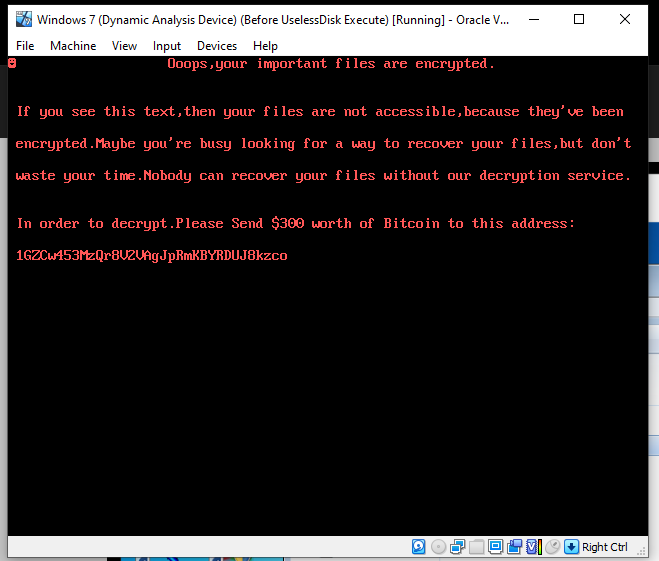
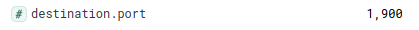
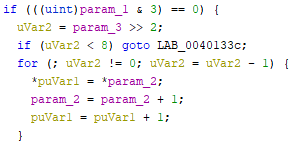

# UselessDisk Addendum

Written by Martijn van den Berk.

Published on the 25th of November, 2021.

Complementary to the [UselessDisk report](./uselessdisk.md).

## Contents

<section>
    <ol>
        <li><a href="#valid-windows-10-pro-boot-record">Valid Windows 10 Pro boot record</a>
            <ol>
                <li><a href="#mbr-sector-0">MBR sector 0</a></li>
                <li><a href="#gpt-sector-0">GPT sector 0</a></li>
            </ol>
        </li>
        <li><a href="#malware-analysis-setup">Malware analysis setup</a>
            <ol>
                <li><a href="#environment">Environment</a></li>
                <li><a href="#tools">Tools</a></li>
            </ol>
        </li>
        <li><a href="#the-process">The process</a></li>
    </ol>
</section>

<div id="valid-windows-10-pro-boot-record"/>

## 1. Valid Windows 10 Pro boot record

These boot records have been confirmed to work in VirtualBox, for a 64-bit Windows 10 Pro system.

MBR with BIOS and GPT with EFI.

<div id="mbr-sector-0"/>

### 1.1. MBR sector 0

```cpp
0x33 0xc0 0x8e 0xd0 0xbc 0x00 0x7c 0x8e 0xc0 0x8e 0xd8 0xbe 0x00 0x7c 0xbf 0x00 0x06 0xb9 0x00 0x02 0xfc 0xf3 0xa4 0x50 0x68 0x1c 0x06 0xcb 0xfb 0xb9 0x04 0x00 0xbd 0xbe 0x07 0x80 0x7e 0x00 0x00 0x7c 0x0b 0x0f 0x85 0x0e 0x01 0x83 0xc5 0x10 0xe2 0xf1 0xcd 0x18 0x88 0x56 0x00 0x55 0xc6 0x46 0x11 0x05 0xc6 0x46 0x10 0x00 0xb4 0x41 0xbb 0xaa 0x55 0xcd 0x13 0x5d 0x72 0x0f 0x81 0xfb 0x55 0xaa 0x75 0x09 0xf7 0xc1 0x01 0x00 0x74 0x03 0xfe 0x46 0x10 0x66 0x60 0x80 0x7e 0x10 0x00 0x74 0x26 0x66 0x68 0x00 0x00 0x00 0x00 0x66 0xff 0x76 0x08 0x68 0x00 0x00 0x68 0x00 0x7c 0x68 0x01 0x00 0x68 0x10 0x00 0xb4 0x42 0x8a 0x56 0x00 0x8b 0xf4 0xcd 0x13 0x9f 0x83 0xc4 0x10 0x9e 0xeb 0x14 0xb8 0x01 0x02 0xbb 0x00 0x7c 0x8a 0x56 0x00 0x8a 0x76 0x01 0x8a 0x4e 0x02 0x8a 0x6e 0x03 0xcd 0x13 0x66 0x61 0x73 0x1c 0xfe 0x4e 0x11 0x75 0x0c 0x80 0x7e 0x00 0x80 0x0f 0x84 0x8a 0x00 0xb2 0x80 0xeb 0x84 0x55 0x32 0xe4 0x8a 0x56 0x00 0xcd 0x13 0x5d 0xeb 0x9e 0x81 0x3e 0xfe 0x7d 0x55 0xaa 0x75 0x6e 0xff 0x76 0x00 0xe8 0x8d 0x00 0x75 0x17 0xfa 0xb0 0xd1 0xe6 0x64 0xe8 0x83 0x00 0xb0 0xdf 0xe6 0x60 0xe8 0x7c 0x00 0xb0 0xff 0xe6 0x64 0xe8 0x75 0x00 0xfb 0xb8 0x00 0xbb 0xcd 0x1a 0x66 0x23 0xc0 0x75 0x3b 0x66 0x81 0xfb 0x54 0x43 0x50 0x41 0x75 0x32 0x81 0xf9 0x02 0x01 0x72 0x2c 0x66 0x68 0x07 0xbb 0x00 0x00 0x66 0x68 0x00 0x02 0x00 0x00 0x66 0x68 0x08 0x00 0x00 0x00 0x66 0x53 0x66 0x53 0x66 0x55 0x66 0x68 0x00 0x00 0x00 0x00 0x66 0x68 0x00 0x7c 0x00 0x00 0x66 0x61 0x68 0x00 0x00 0x07 0xcd 0x1a 0x5a 0x32 0xf6 0xea 0x00 0x7c 0x00 0x00 0xcd 0x18 0xa0 0xb7 0x07 0xeb 0x08 0xa0 0xb6 0x07 0xeb 0x03 0xa0 0xb5 0x07 0x32 0xe4 0x05 0x00 0x07 0x8b 0xf0 0xac 0x3c 0x00 0x74 0x09 0xbb 0x07 0x00 0xb4 0x0e 0xcd 0x10 0xeb 0xf2 0xf4 0xeb 0xfd 0x2b 0xc9 0xe4 0x64 0xeb 0x00 0x24 0x02 0xe0 0xf8 0x24 0x02 0xc3 0x49 0x6e 0x76 0x61 0x6c 0x69 0x64 0x20 0x70 0x61 0x72 0x74 0x69 0x74 0x69 0x6f 0x6e 0x20 0x74 0x61 0x62 0x6c 0x65 0x00 0x45 0x72 0x72 0x6f 0x72 0x20 0x6c 0x6f 0x61 0x64 0x69 0x6e 0x67 0x20 0x6f 0x70 0x65 0x72 0x61 0x74 0x69 0x6e 0x67 0x20 0x73 0x79 0x73 0x74 0x65 0x6d 0x00 0x4d 0x69 0x73 0x73 0x69 0x6e 0x67 0x20 0x6f 0x70 0x65 0x72 0x61 0x74 0x69 0x6e 0x67 0x20 0x73 0x79 0x73 0x74 0x65 0x6d 0x00 0x00 0x00 0x63 0x7b 0x9a 0xd9 0x18 0x1b 0x3c 0x00 0x00 0x80 0x20 0x21 0x00 0x07 0x7f 0x39 0x06 0x00 0x08 0x00 0x00 0x00 0x90 0x01 0x00 0x00 0x7f 0x3a 0x06 0x07 0xfe 0xff 0xff 0x00 0x98 0x01 0x00 0x6e 0x70 0xee 0x09 0x00 0xfe 0xff 0xff 0x27 0xfe 0xff 0xff 0x00 0x10 0xf0 0x09 0x00 0xe0 0x0f 0x00 0x00 0x00 0x00 0x00 0x00 0x00 0x00 0x00 0x00 0x00 0x00 0x00 0x00 0x00 0x00 0x00 0x55 0xaa
```

<div id="gpt-sector-0"/>

### 1.2. GPT sector 0

```cpp
0x00 0x00 0x00 0x00 0x00 0x00 0x00 0x00 0x00 0x00 0x00 0x00 0x00 0x00 0x00 0x00 0x00 0x00 0x00 0x00 0x00 0x00 0x00 0x00 0x00 0x00 0x00 0x00 0x00 0x00 0x00 0x00 0x00 0x00 0x00 0x00 0x00 0x00 0x00 0x00 0x00 0x00 0x00 0x00 0x00 0x00 0x00 0x00 0x00 0x00 0x00 0x00 0x00 0x00 0x00 0x00 0x00 0x00 0x00 0x00 0x00 0x00 0x00 0x00 0x00 0x00 0x00 0x00 0x00 0x00 0x00 0x00 0x00 0x00 0x00 0x00 0x00 0x00 0x00 0x00 0x00 0x00 0x00 0x00 0x00 0x00 0x00 0x00 0x00 0x00 0x00 0x00 0x00 0x00 0x00 0x00 0x00 0x00 0x00 0x00 0x00 0x00 0x00 0x00 0x00 0x00 0x00 0x00 0x00 0x00 0x00 0x00 0x00 0x00 0x00 0x00 0x00 0x00 0x00 0x00 0x00 0x00 0x00 0x00 0x00 0x00 0x00 0x00 0x00 0x00 0x00 0x00 0x00 0x00 0x00 0x00 0x00 0x00 0x00 0x00 0x00 0x00 0x00 0x00 0x00 0x00 0x00 0x00 0x00 0x00 0x00 0x00 0x00 0x00 0x00 0x00 0x00 0x00 0x00 0x00 0x00 0x00 0x00 0x00 0x00 0x00 0x00 0x00 0x00 0x00 0x00 0x00 0x00 0x00 0x00 0x00 0x00 0x00 0x00 0x00 0x00 0x00 0x00 0x00 0x00 0x00 0x00 0x00 0x00 0x00 0x00 0x00 0x00 0x00 0x00 0x00 0x00 0x00 0x00 0x00 0x00 0x00 0x00 0x00 0x00 0x00 0x00 0x00 0x00 0x00 0x00 0x00 0x00 0x00 0x00 0x00 0x00 0x00 0x00 0x00 0x00 0x00 0x00 0x00 0x00 0x00 0x00 0x00 0x00 0x00 0x00 0x00 0x00 0x00 0x00 0x00 0x00 0x00 0x00 0x00 0x00 0x00 0x00 0x00 0x00 0x00 0x00 0x00 0x00 0x00 0x00 0x00 0x00 0x00 0x00 0x00 0x00 0x00 0x00 0x00 0x00 0x00 0x00 0x00 0x00 0x00 0x00 0x00 0x00 0x00 0x00 0x00 0x00 0x00 0x00 0x00 0x00 0x00 0x00 0x00 0x00 0x00 0x00 0x00 0x00 0x00 0x00 0x00 0x00 0x00 0x00 0x00 0x00 0x00 0x00 0x00 0x00 0x00 0x00 0x00 0x00 0x00 0x00 0x00 0x00 0x00 0x00 0x00 0x00 0x00 0x00 0x00 0x00 0x00 0x00 0x00 0x00 0x00 0x00 0x00 0x00 0x00 0x00 0x00 0x00 0x00 0x00 0x00 0x00 0x00 0x00 0x00 0x00 0x00 0x00 0x00 0x00 0x00 0x00 0x00 0x00 0x00 0x00 0x00 0x00 0x00 0x00 0x00 0x00 0x00 0x00 0x00 0x00 0x00 0x00 0x00 0x00 0x00 0x00 0x00 0x00 0x00 0x00 0x00 0x00 0x00 0x00 0x00 0x00 0x00 0x00 0x00 0x00 0x00 0x00 0x00 0x00 0x00 0x00 0x00 0x00 0x00 0x00 0x00 0x00 0x00 0x00 0x00 0x00 0x00 0x00 0x00 0x00 0x00 0x00 0x00 0x00 0x00 0x00 0x00 0x00 0x00 0x00 0x00 0x00 0x00 0x00 0x00 0x00 0x00 0x00 0x00 0x00 0x00 0x00 0x00 0x00 0x00 0x00 0x00 0x00 0x00 0x00 0x00 0x00 0x00 0x00 0x00 0x00 0x00 0x00 0x00 0x00 0x00 0x00 0x00 0x00 0x00 0x00 0x00 0x07 0x5E 0x53 0xBC 0x00 0x00 0x00 0x00 0x02 0x00 0xEE 0xFE 0x7F 0x99 0x01 0x00 0x00 0x00 0xFF 0xFF 0xFF 0xFF 0x00 0x00 0x00 0x00 0x00 0x00 0x00 0x00 0x00 0x00 0x00 0x00 0x00 0x00 0x00 0x00 0x00 0x00 0x00 0x00 0x00 0x00 0x00 0x00 0x00 0x00 0x00 0x00 0x00 0x00 0x00 0x00 0x00 0x00 0x00 0x00 0x00 0x00 0x00 0x00 0x00 0x00 0x00 0x00 0x00 0x00 0x00 0x00 0x55 0xAA
```

<div id="malware-analysis-setup"/>

## 2. Malware analysis setup

Following here is the environment and the tools used to analyze the UselessDisk malware.

<div id="environment"/>

### 2.1. Environment


All systems, aside from the Host, are virtual machines running on the Host within VirtualBox. Snapshots were taken of the systems before the analysis.

The pfSense firewall has a NAT rule to allow SSH (port 22) traffic from the host via OPT1 to reach the Ubuntu Server that is on the LAN.

The pfSense firewall also has a firewall rule that allows HTTPS (port 443) traffic from the host via OPT1 to reach itself.

The Ubuntu Server has SFTP setup, which is used to bring malware samples into the environment without relying on VirtualBox Guest Additions. Which may be detected by anti-analysis techniques.

The Ubuntu Server also has Zeek and ELK Stack running. For network analysis.

The Windows 10 Pro and Windows 7 Ultimate have the same tools installed.

They are also configured with Windows Update disabled, the Firewall turned off, and Windows Defender turned off as well.

<div id="tools"/>

### 2.2. Tools

For malware analysis, which was done on the Windows 10 Pro and Windows 7 Ultimate machines, the following tools were used:

- Wireshark
- Regshot
- FileActivityWatch
- xDBG
- FolderChangesView
- HxD
- Ghidra
- PEStudio
- CFF Explorer
- ExeInfo PE

<div id="the-process"/>

## 3. The process

Now for the actual analysis process, described in detail with screenshots of important finds.

- For starters, the malware was run on the Windows 7 Ultimate machine, since this was also the machine that first detected the malware in Any.Run, without any tooling running. To test if it worked. 




- As one can see, the message is shown, and infection is confirmed to work. Nothing else can be done at this point but return the VM to a previous snapshot.





- Though some network traffic was captured, one packet to be exact, this turned out to be a harmless SSDP call made by the Windows machine. An uninfected machine made the same call. It was just a coincidence.
- After having excluded the involvement of network related functionality it was time to get into the malware itself.


- From the ExeInfo PE analysis we can see two interesting things.
    - First, that the target language is Microsoft Visual C++
    - Second, that it has not been packed at all. This especially makes analysis much easier.


- Here the hash values for the executable section of the PE can be seen. PEStudio ended up being mostly used for further analysis, with CFF Explorer being left at the wayside.


- Upon checking the strings found in the PE, some interesting results came by.
    - DeviceIoControl was one that immediately jumped out. It was the only one I had not yet heard of, nor had any idea what it did.
    - So, after a quick search I discovered it is used to send Kernel level messages to devices. A very strange, and interesting function. A prime target.
    - [https://docs.microsoft.com/en-us/windows/win32/api/ioapiset/nf-ioapiset-deviceiocontrol](https://docs.microsoft.com/en-us/windows/win32/api/ioapiset/nf-ioapiset-deviceiocontrol)
- After this discovery I found it comfortable enough to open the malware in Ghidra to see what its guts looked like.
    - Keeping the DeviceIoControl function in mind, of course.


- Upon opening the malware in Ghidra it was trivial to find the DeviceIoControl function (which was used twice) in the code.
    - From the rest of the code it can also be spotted, particularly the WinExec at the bottom and the WriteFile near the center, that this function was very important to the malware.
- After having spent some time looking up what all the function variables could be I spent some time hunting down their values.
    - Tools were also made to help with this. A tool that allows for guesses at how combined flags were made was created to help simplify this process. This allowed me to discovery that the 0xC flag in CreateFileA was a combined GENERIC_WRITE/GENERIC_READ flag.
    - [https://github.com/aTerriblySadCat/Windows-Flag-Decoder](https://github.com/aTerriblySadCat/Windows-Flag-Decoder)


- Considering the one non-Win32 function was the most enigmatic, I felt it important to figure out what it did. And that I did.
    - The DAT value being referenced turned out to reference the place in the executable file where the locker message was stored.
    - From this I could deduce that this function most likely loads the second parameter into the first parameter, as the first parameter (local_210) is later used in the WriteFile function.


- A quick sidetrack was made to see if this Bitcoin address did have any transactions to its name. Thankfully it did not.


- After this I opened the malware in xDBG32 (run with administrator privileges) to discover how the execution of the malware flows.


- Here we see what the malware writes to disk in full. For now, the importance of the 55 AA right after the end of the message was not yet known to me, but eventually it was.
    - The 55 AA is used to end a boot record.


- Seen here is the reference to the memory location 19FCD4 in the ECX register. This is the memory address pointed at by the local_210 variable.
- Then I let the WriteFile execute and see what changed on the system.


- This was also the point where I became quite sure that the malware did not encrypt any files.
    - The only writes performed by the malware seemed to happen in the money function, and it only writes 512 bytes to PHYSICALDISK0.


- I then used a very quick Python script to check if what the malware claimed to write was indeed written onto the disk. Which it was.


- And to confirm again, we can see that a handle to the PHYSICALDISK0 is active. And no other files, aside from itself.


.png)

- And here we can again see that UselessDisk does almost nothing. It does not change any file on the system in any way.


- Using a tool that I created to quickly find strings in large files (11GB in this case) I discovered that the Bitcoin address associated with the malware was found twice instead of the expected once.
    - The reason for this would later turn out to be that one is the boot record entry, and the other is the string in the executable on the disk.
    - I used the tool on the host, where I had full access to the VM hard disk file.
    - [https://github.com/aTerriblySadCat/String-Extractor](https://github.com/aTerriblySadCat/String-Extractor)
- Upon realizing how the malware operated, not actually encrypting files I theorized that it should be possible to unlock the system.
    - For this reason, I created a tool that allowed me to read and write bytes to specific parts in a file.
    - I used this to analyze the way boot records operate and what a proper boot record should look like.
    - I then overwrote the 512 bytes of malicious boot record with a valid one and started the machine up again.
    - It worked like a charm.
    - Though untested on a physical hard disk, it should work the same since nothing else is touched by the malware. Just the 512 bytes on PHYSICALDRIVE0.
    - [https://github.com/aTerriblySadCat/Byte-Reader](https://github.com/aTerriblySadCat/Byte-Reader)
    - [https://github.com/aTerriblySadCat/Byte-Writer](https://github.com/aTerriblySadCat/Byte-Writer)
- After having figured out what the malware does in general terms and having found a cure for the infection, I decided to take a closer at the one function I did not figure out quite yet. The one non-Win32 function.


- Seen here is only a small part of the function. It is a massive web of IF, ELSE, and SWITCH statements.
    - However, when the malware runs as intended it simply runs a FOR loop that fills the address at param_1 with the contents found at the address of param_2, for the length of param_3 shifted right by 2.
    - So, to put things simply, it basically just copies one array into another array.




- Within Ghidra it is also shown that this FOR loop is an assembly OP referred to as MOVSD.REP
    - The REP part refers to the fact that it is repeating.
    - The MOVSD part refers to the moving of data from one register to another. A doubleword, to be exact, which is 2 bytes.
    - It also happens that UTF-16 encoded characters are 2 bytes in size. Therefore, this may be an indication that the characters are UTF-16 encoded.
- Upon some further investigation, it seems memcpy is VERY like the FUN function.
    - [https://www.cplusplus.com/reference/cstring/memcpy/](https://www.cplusplus.com/reference/cstring/memcpy/)
- It seems they do not compile the same, however, something similar to how the FOR loop works is done with memcpy, so it or something similar may convert to it.
    - It is for these reasons that I don’t think the mystery function is some custom, dynamic boot record generator.
    - It is probably either a custom function as memcpy (perhaps so there’re less dependencies needed), a variant of memcpy, or a much older version of memcpy.


